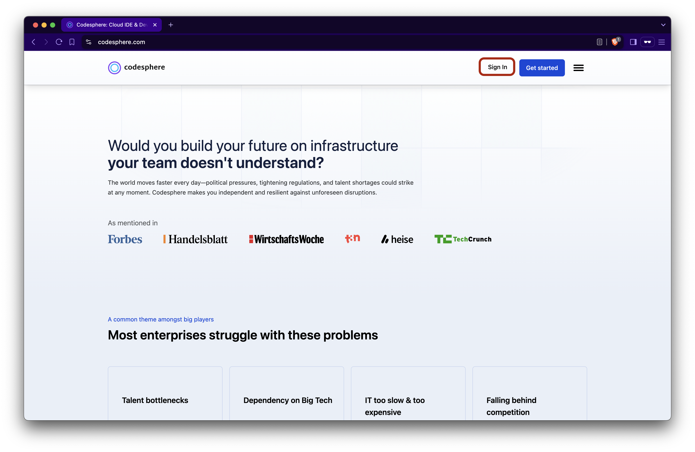
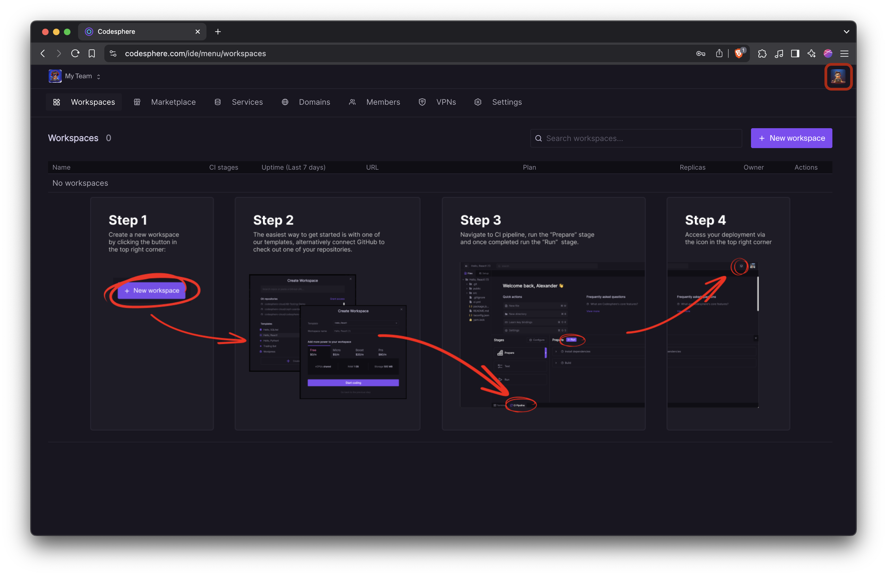
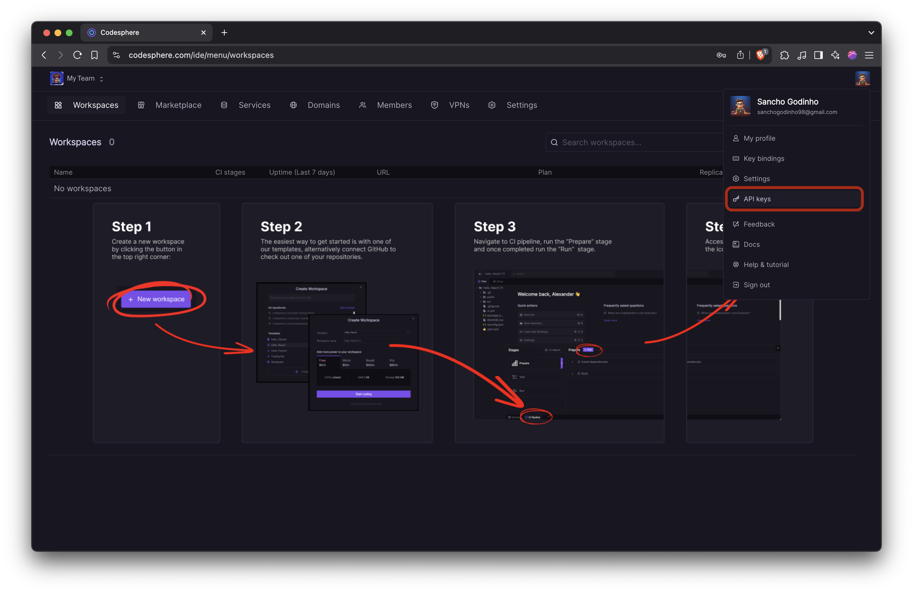
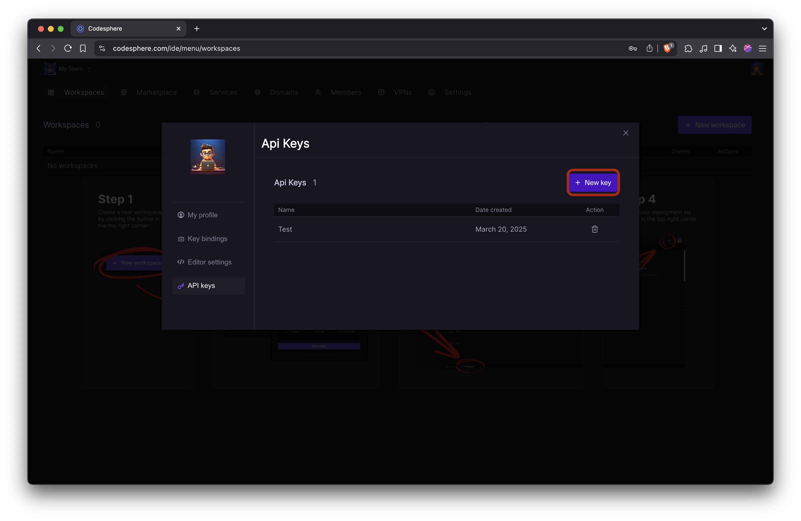
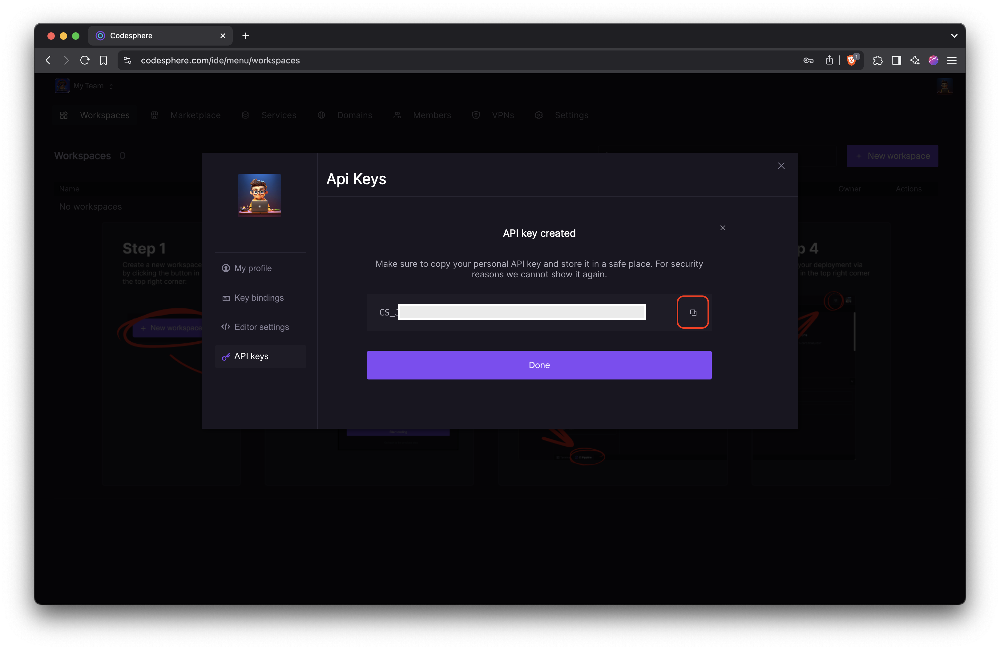
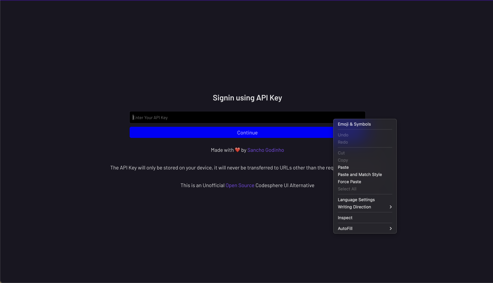

# Codesphere Alt UI
An alternate UI for Codesphere with faster loading time and features like create app with AI.

 

## Features
- Blazing Fast UI
- Team Picker Support
- Create Workspace
- Search Workspaces
- Delete Workspace
- View Domains
- Create Domain
- Verify Domain
- Delete Domain
- Search Domains

## Todos  
- Implement Create New Team

 

## How to get started?
Open https://codesphere-ui.sg-app.com/  

After that, follow the below steps:
1. Signin/Signup on <a href="https://codesphere.com" target="_blank">codesphere.com</a>.

2. Click the profile button on the top right of the dashboard.

3. Click the "API keys" button under the the top right profile button on the dashboard.

4. Click the "+ New key"

5. Click on the copy symbol to copy the API Key. Then click on "Done" button.

6. Paste your API Key in the Codesphere alternative UI website and then click the "Continue" button.

 

## Is my API Key stored securely?
Yes, your API key is stored securely using cookies on your own device. The API key is not sent on any external server other than that of the Codesphere API.

 

## What data is collected?
No data is collected by me as a developer. API calls are directly made to the Codesphere API server.

 

Built with ❤️ by <a href="https://sancho1952007.github.io" target="_blank">Sancho Godinho</a>